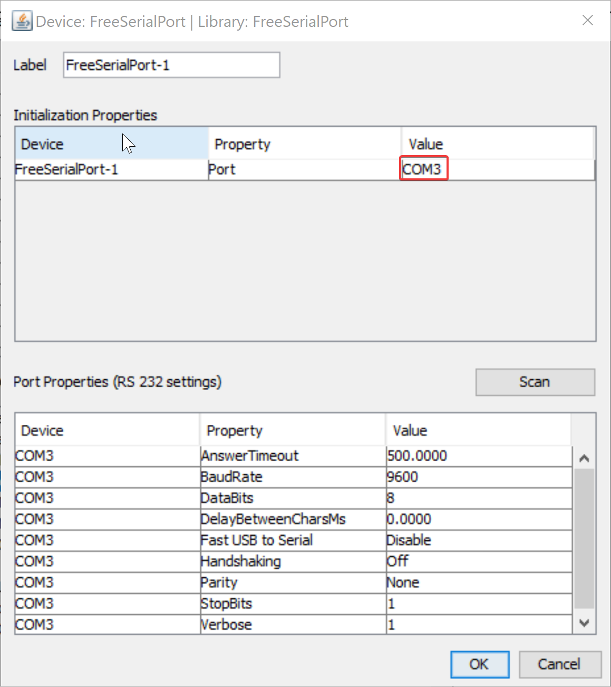

# PumpControls
Interfacing pumpy with Micro-Manager and scope

We designed this class to be beanshell script friendly at the cost of some user friendly options such as a GUI. Much of the code and hardware for this project was developed from concepts found in [NanoJ-Fluidics](https://github.com/HenriquesLab/NanoJ-Fluidics/wiki).

### Installation instructions:
#### Micro-Manager-1.4:

* Navigate to your MicroManger-1.4 install location (something like C:/Program Files/Micro-Manager-1.4).

* Install [pumpControllerV1.jar](https://github.com/espruston/PumpControls/blob/master/pumpControllerV1.jar) under Micro-Manager-1.4/plugins/Micro-Manager

* If Micro-Manager is open during installation, you will need to close and re-open it for the changes to take effect.

* [Set up FreeSerialPort](https://micro-manager.org/wiki/FreeSerialPort) in Micro-Manager hardware configuration under "Tools>Hardware Configuration Wizard. While you're here, take note of the port label (shown in the picture below). You will need to restart Micro-Manager in order for hardware configuration changes to take effect.



* Open Micro-Manager script panel under "Tools>Script Panel".

* Use "import pumpController.Pumps;" at the top of your script.

* Create the Pumps object using "Pumps objectName = new Pumps(String portLabel);".

* Call any commands using "objectName.command();".

#### Micro-Manager-2.0gamma:

* Navigate to your MicroManger-2.0gamma install location (something like C:/Program Files/Micro-Manager-2.0gamma).

* Install [pumpControllerV2.jar](https://github.com/espruston/PumpControls/blob/master/pumpControllerV2.jar) under Micro-Manager-2.0gamma/plugins/Micro-Manager

* If Micro-Manager is open during installation, you will need to close and re-open it for the changes to take effect.

* [Set up FreeSerialPort](https://micro-manager.org/wiki/FreeSerialPort) in Micro-Manager hardware configuration under "Devices>Hardware Configuration Wizard. While you're here, take note of the port label (shown in the picture below). You will need to restart Micro-Manager in order for hardware configuration changes to take effect.


* Open Micro-Manager script panel under "Tools>Script Panel".

* Use "import pumpController.Pumps;" at the top of your script.

* Find serial port label under windows "Bluetooth and other devices" menu.

* Create the Pumps object using "Pumps objectName = new Pumps(String portLabel);".

* Call any commands using "objectName.command();".


### Command list:

```
startup();
```
Connects to serialPort, sets all motors to 100% speed

___

```
setSpeed(char Shield, char Motor, char n1, char n2, char n3); 
```
Sets speed of Motor on Shield to n1n2n3

___

```
runMotor(char Shield, char Motor, char Direction, char t1, char t2, char t3, chat t4, char t5); 
```

Runs Motor on Shield in Direction for t1t2t3t4t5 seconds

___

```
wash(int numberOfWashes, int bufferSitTime, int washVolume); 
```

Washes the chamber a specified number of times with the sepcified ammount of mL sitting in the chamber for the specified ammount of time.

___

```
clearChamber();
```

Clears any fluid remaining in the chamber.

___

```
setAllFull();
```

Sets all motors to full speed. Is called by startup().

___

```
connect();
```

Connects to serial port. Is called by startup().

___

```
makeRun();
```

Initializes vector used to run motors. Is called by startup(). Should always be called before first call to runMotor().

___

```
makeSpeed
```

Initializes vector used to set motor speeds. Is called by startup(). Should always be called before first call to setSpeed().

#### Notes:

* pumpController is currently not formatted as a plugin for Micro-Manager. It is important not to install the .jar into the mmplugins folder as it will break your Micro-Manager GUI.

* All calls to a method within the Pumps class will automatically log to your MicroManger CoreLog, located in Micro-Manager-1.4/CoreLogs. This should make debugging much easier for developers.

* When attempting to launch Micro-Manager after installing pumpControllerV2 you may be told you need to update ImageJ. In order to do so, do not use the suggested "Help>Update ImageJ", instead follow the instructions [HERE](https://imagej.nih.gov/ij/plugins/updater/).

* For simplicity, the motor and shield values are hard-coded for our group's hardware configuration as of 7/5/2019. Our configuration is four geared pumps on shield 1 and two perastaltic pumps on shield 2 (motors 3 and 4). We infuse buffer using shield 2, motor 4 and clear waste using shield 2, motor 3. 
  * These values are hard coded in Pumps.java. To reformat for your pump setup, simply clone the directory, change the values in clearChamber and wash to your corresponding shield and motor values then recompile the project .jar file and reinstall in the manner described above. It should further be noted that if reformatting perastaltic pumps, the direction may also be flipped to meet the design of the hardware.
